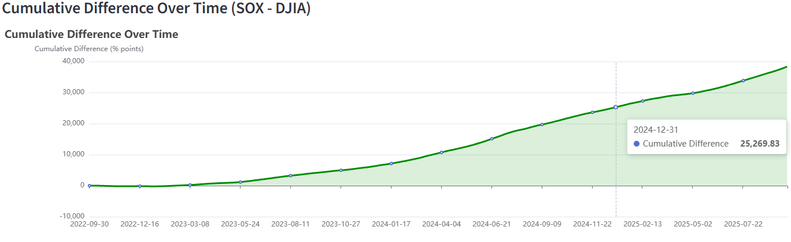

# 📈 SOX vs DJIA Positive/Negative Return Comparison

This project is a **Streamlit** web application for visualizing and comparing the cumulative returns of the **Philadelphia Semiconductor Index (SOX)** and the **Dow Jones Industrial Average (DJIA)** over different time windows.

---

## ✨ Features

* 📊 **Data Fetching**: Automatically download historical data for SOX and DJIA using [yfinance](https://pypi.org/project/yfinance/)
* 🔄 **Time Window Selection**: Choose among

  * Last 1 Month
  * Last 3 Months
  * Last 6 Months
  * Year-to-Date (YTD)
  * Last 1 Year
  * Last 3 Years
* 📈 **Normalized Comparison**: Normalize both indices to 100 at the start for intuitive visual comparison
* ➖ **Difference Analysis**: Compute the difference between SOX and DJIA and show the latest difference value
* 📉 **Cumulative Difference Plot**: Display the cumulative difference over the selected period

---

## 📦 Installation

Make sure you have **Python 3.9+** installed. Then install the required packages:

```bash
pip install -r requirements.txt
```

`requirements.txt` example:

```
streamlit
yfinance
pandas
matplotlib
```

---

## 🚀 Run the App

Run the app in the project directory:

```bash
streamlit run etftrack.py
```

A browser window will automatically open at [http://localhost:8501](http://localhost:8501).

---

## 📷 Screenshots

### 1. Time Window Selection

Select different time windows on the sidebar:


### 2. Normalized Cumulative Returns

Blue = SOX, Orange = DJIA, Green dashed = Difference:


### 3. Cumulative Difference

Green shaded area = cumulative difference of SOX relative to DJIA:



---

## 📁 Project Structure

```
.
├── etftrack.py         # Main application script
├── README.md           # Project documentation
├── requirements.txt    # Dependencies list
└── docs/               # Optional screenshots folder
```

---

## 🔮 Future Improvements

* [ ] Annotate max/min points on the cumulative difference chart
* [ ] Add more indices for comparison (e.g., NASDAQ, S&P 500)
* [ ] Implement backtesting for investment strategies

---

## 📝 License

This project is for educational and research purposes only. Data is sourced from Yahoo Finance.
Author: Shaoxian Duan
